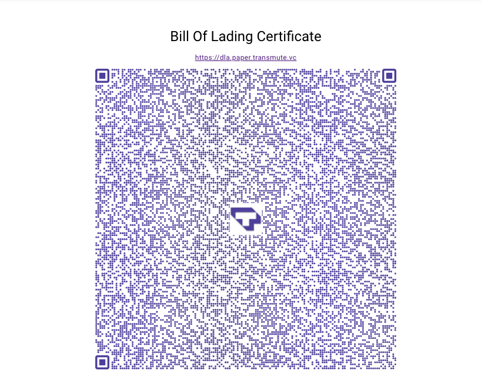

# Defense Logistics Paper Credentials

This is the code behind a public demo we built for a defense logistics use case involving hypothetical use of DIDs and VCs for defense supply chains.

The demo can be found here (suggest opening this link on a mobile phone):

- [dla.paper.transmute.vc](https://dla.paper.transmute.vc/)

You can scan this qr code to verify the credential claims embedded in it.

Beware that because this demo is intentionally maxing out the possible bytes easily transmitted optically (via qr codes), it may take a steady hand or a nice camera to read the QR code... Transmitting less information would reduce this painfulness of this experience, but defeat the purpose of the demo, which is to show that CBOR-LD is the most efficient way to transport large JSON-LD payloads.

### About This Demo

This demo uses the following W3C TRs:

- [https://www.w3.org/TR/did-core/](https://www.w3.org/TR/did-core/)
- [https://www.w3.org/TR/vc-data-model/](https://www.w3.org/TR/vc-data-model/)

This demo relies on the following W3C CCG Community Drafts:

- [w3id.org/security/suites/bls12381-2020](https://w3id.org/security/suites/bls12381-2020)
- [digitalbazaar.github.io/cbor-ld-spec/](https://digitalbazaar.github.io/cbor-ld-spec/)

This demo uses open source software listed below:

- [CBOR-LD](https://github.com/digitalbazaar/cborld)
- [DID Key](https://github.com/transmute-industries/did-key.js)
- [Verifiable Credentials](https://github.com/transmute-industries/verifiable-data/tree/main/packages/vc.js)

If you have questions, feel free to reach out to us at [transmute.industries/](https://transmute.industries/).
